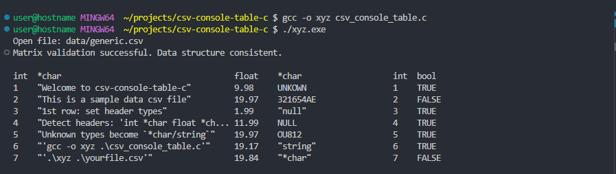

# CSV Console Table in C

This C implementation provides precise control over data validation and table formatting, ensuring column types match while creating clean, aligned console output - making it ideal for consistent data snapshots and type verification.

## Example Input CSV ([`generic.csv`](data/generic.csv)):

```csv
1,"Welcome to csv-console-table-c",9.98,UNKOWN,1,true
2,"This is a sample data csv file",19.97,321654AE,2,false
3,"1st row: set header types",1.99,"null",3,true
4,"Detect headers: 'int *char float *char int bool'",11.99,NULL,4,true
5,"Unknown types become `*char/string`",19.97,OU812,5,true
6,"'gcc -o xyz .\csv_console_table.c'",19.17,"string",6,true
7,"'.\xyz .\yourfile.csv'",19.84,"*char",7,false
```

## Example Output 



## Features

- Reads CSV files and displays data in aligned console tables
- Validates data types against column headers
- Handles dynamic content with proper memory management
- Supports customizable column widths and formatting

## Usage

- **PowerShell**:
   - gcc -o csv_table csv_console_table.c
   - ./csv_table generic.csv

- Please see [Console Output](screenshots/csv_console_example.txt) for example output

## Requirements
 
 - C compiler (gcc recommended)
 - Standard C libraries

## Purpose

- This implementation provides:
   - Create a "Snapshot" view using custom control over data validation and display
   - Ensure data integrity through type checking
   - Platform independence
   - Educational resource for C development practices

## Similar Built-in Commands

While this project serves as both a learning implementation and custom solution, here are equivalent commands in other environments (Requires named columns, "id", "name", "age"...):

- **PowerShell**:
   -Import-Csv "data.csv" | Format-Table

- **BASH**:
   -csvcut -c 1,2,3 data.csv

## License
 
 - This project is licensed under the MIT License. See the [LICENSE](LICENSE) file for details.
